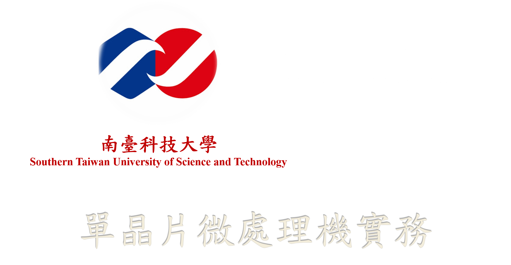

<div style="text-align: center;">

</div>

<hr style="border:4px solid gray"> </hr>

<div style="text-align: center;">    
<br>    
    
## I²C Basic Tutorials  
# Raspberry Pi I²C Serial Communication

</div>

<br>
<hr style="border:4px solid gray"> </hr>


# Reference

* [The Raspberry Pi GPIO pinout guide.](https://pinout.xyz/)
> https://pinout.xyz/

* [Synchronous serial communication in Raspberry Pi using I2C protocol](https://www.engineersgarage.com/raspberrypi/articles-raspberry-pi-i2c-bus-pins-smbus-smbus2-python/)
> https://www.engineersgarage.com/raspberrypi/articles-raspberry-pi-i2c-bus-pins-smbus-smbus2-python/

* [Communication between Raspberry Pi and Arduino with I2C](https://www.aranacorp.com/en/communication-between-raspberry-pi-and-arduino-with-i2c/)
> https://www.aranacorp.com/en/communication-between-raspberry-pi-and-arduino-with-i2c/

<hr style="border:0.5px solid gray"> 

# I²C vs SMBus

* The `I²C` bus and the `SMBus™` are popular 2-wire buses that are essentially compatible with each other. 
* The `System Management Bus (SMBus)` is more or less a derivative of the `Inter Integrated Circuit (I²C)` bus. 
* Normally devices, both masters and slaves, are `freely interchangeable` between both buses. 
* The buses operate at the same speed, up to `100kHz`, but the `I²C` bus has both `400kHz and 2MHz` versions. 
* Complete compatibility between both buses is ensured only `below 100kHz.`


<hr style="border:2px solid orange"> </hr>

# Arduino Sketch: rpi_i2c_lab01.uno

<hr style="border:0.5px solid gray"> 

```C++
#include <Wire.h>
# define I2C_ADDR 11
char sbuf[50];
bool pending = false;
byte msg[20];
byte cmd;
unsigned len;
```

<hr style="border:0.5px solid gray"> 

```C++
void setup() {
  Wire.begin(I2C_ADDR);
  Serial.begin(9600); 
  sprintf(sbuf,"Arduino I2C Slave(%d)",I2C_ADDR);
  Serial.println(sbuf);
  Serial.println("===================================");
  delay(1000);    
  // register Request/Receive event services           
  Wire.onRequest(irsRequest);
  Wire.onReceive(irsReceive);
}
```

<hr style="border:0.5px solid gray"> 

```C++
void loop() {
  if (pending) {
    Serial.print("received : ");
    for(int i=0; i<len; i++) {
      Serial.print(msg[i]);
      Serial.print(" ");
    }
    Serial.println();
    pending = false;
  }
  delay(200);
}
```

<hr style="border:0.5px solid gray"> 

```C++
void irsRequest() {
  unsigned rn;
  Serial.print("irsRequest send => ");
  switch(cmd) {
    case 11 : len = 3;
              break;
    case 123: len = 5;
              break;
    default: len = 1;
  }
  for(int i=0; i<len; i++) {
    rn = random(1,6);
    Serial.print(rn);
    Serial.print(" ");
    Wire.write(rn);
  }
  Serial.println();
}
```

<hr style="border:0.5px solid gray"> 

```C++
void irsReceive(int nb) {  
  Serial.print("irsReceive # of bytes = "); 
  Serial.println(nb);
  if (nb==1) {
    cmd = Wire.read();   
    Serial.print("  cmd = "); 
    Serial.println(cmd);
  } else {
    len = 0;
    while (Wire.available())
      msg[len++] = Wire.read();  
    pending = true;
  }
}
```

<hr style="border:2px solid orange"> </hr>

## Lab 01 : Raspberry Pi (Master) → Arduino (Slave)

<hr style="border:1px solid gray"> 


```python
import smbus2 as smbus 
from time import sleep
from random import randrange, random
from struct import pack, unpack

I2C_ADDR = 11
PORT = 1

def i2c_write(data):
    i2cbus = smbus.SMBus(PORT)
    i2cbus.write_byte(I2C_ADDR, ord(data))
    sleep(0.5)

def main(msg):
    _ = [i2c_write(c) for c in msg]
    
if __name__ == '__main__':
    main("I2C")
```

<hr style="border:0.5px solid gray"> 

```
Arduino I2C Slave(11)
===================================
irsReceive # of bytes = 1
  cmd = 73
irsReceive # of bytes = 1
  cmd = 50
irsReceive # of bytes = 1
  cmd = 67
```

<hr style="border:1px solid gray"> 


```python
import smbus2 as smbus 
from time import sleep
from random import randrange, random
from struct import pack, unpack

I2C_ADDR = 11
PORT = 1

def i2c_write_bytes(data):
    i2cbus = smbus.SMBus(PORT)
    cmd = 123
    i2cbus.write_i2c_block_data(I2C_ADDR, cmd, data.encode("ascii"))
    sleep(0.5)

def main(msg):
    i2c_write_bytes(msg)
    
if __name__ == '__main__':
    main("I2C")
```
<hr style="border:0.5px solid gray"> 

```
Arduino I2C Slave(11)
===================================
irsReceive # of bytes = 4
received : 123 73 50 67 
```

<hr style="border:2px solid orange"> </hr>

## Lab 02 : Raspberry Pi (Master) ← Arduino (Slave)

<hr style="border:1px solid gray"> 


```python
import smbus2 as smbus 
from time import sleep
from random import randrange, random
from struct import pack, unpack

I2C_ADDR = 11
PORT = 1

def i2c_read():
    i2cbus = smbus.SMBus(PORT)
    data = i2cbus.read_byte(I2C_ADDR)
    sleep(0.5)
    return data

def main():
    recv = [i2c_read() for i in range(5)]
    print(f"receved : {recv}")
    
if __name__ == '__main__':
    main()
```

<hr style="border:0.5px solid gray"> 


```
RPi Output
===================================
receved : [3, 5, 4, 4, 1]

Arduino I2C Slave(11)
===================================
irsRequest send => 3
irsRequest send => 5
irsRequest send => 4
irsRequest send => 4
irsRequest send => 1
```

<hr style="border:1px solid gray"> 


```python
import smbus2 as smbus 
from time import sleep
from random import randrange, random
from struct import pack, unpack

I2C_ADDR = 11
PORT = 1

def i2c_read_bytes(nb):
    i2cbus = smbus.SMBus(PORT)
    cmd = 123
    data = i2cbus.read_i2c_block_data(I2C_ADDR, cmd, nb)
    sleep(0.5)
    return data

def main():
    recv = i2c_read_bytes(5)
    print(f"receved : {recv}")
    
if __name__ == '__main__':
    main()
```

<hr style="border:0.5px solid gray"> 


```
RPi Output
===================================
receved : [3, 5, 4, 4, 1]

Arduino I2C Slave(11)
===================================
irsReceive # of bytes = 1
irsRequest send => 3 5 4 4 1 
```

<br><hr style="border:3px solid red"> </hr>
<div style="text-align: center;">         
    
# *Homework Assignment*

</div>
<hr style="border:3px solid red"> </hr>
<br>

## Homework 01 - Raspberry Pi (Master) `  ← I²C →  ` Arduino (Slave)

* `Raspberry Pi` Test data generator and result check
* `Arduino UNO` Service provider
* Services:
    * sum : returns the sum of all given data  
    * min : returns the smallest number of all given data
    * max : returns the largest number of all given data
    * sort : returns the given data in ascending order
* All data is transmitted through I²C port 1 (GPIO2, GPIO3) of Raspberry Pi and I²C (A4, A5) of Arduino UNO

<hr style="border:2px solid orange"> </hr>
<br>

<div style="text-align: left;">

</div>

